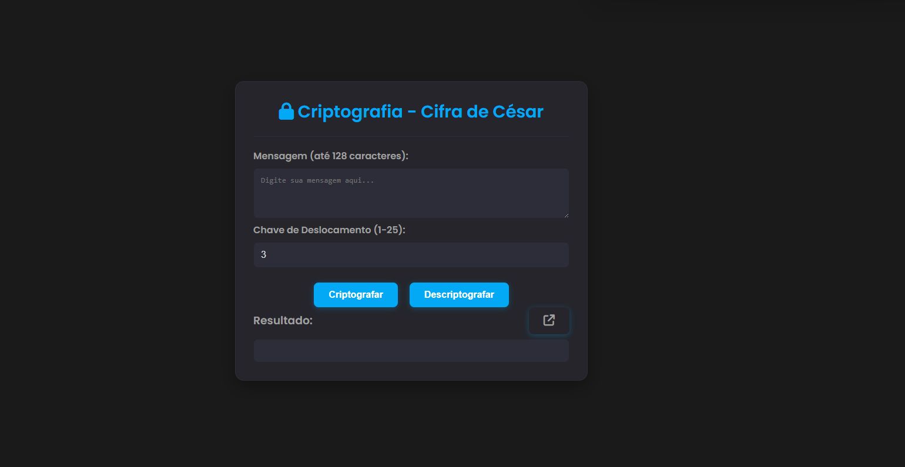

# APS: Criptografia com Cifra de César


<p align="center">
  
</p>

Este é um projeto web interativo que implementa a Cifra de César, uma das mais antigas técnicas de criptografia. A aplicação permite que o usuário criptografe e descriptografe mensagens de texto de forma simples e visual, utilizando uma chave de deslocamento personalizável.

---

## Sobre o Projeto

Este trabalho foi desenvolvido como parte das **Atividades Práticas Supervisionadas (APS)** para o curso de Ciência da Computação da UNICEUG. [cite_start]O objetivo era aplicar conceitos de programação estruturada em um projeto prático que abordasse o tema de técnicas criptográficas. [cite: 2, 6, 8]

* **Instituição:** UNICEUG
* [cite_start]**Curso:** 2º Ciência da Computação [cite: 1]
* [cite_start]**Disciplina Vinculada:** Introdução à Programação Estruturada – IPE [cite: 30]
* [cite_start]**Tema Proposto:** "AS TÉCNICAS CRIPTOGRÁFICAS, CONCEITOS, USOS E APLICAÇÕES" [cite: 8]

---

## Funcionalidades

* **Criptografia de Texto:** Converte um texto legível em um texto cifrado.
* **Descriptografia de Texto:** Reverte o texto cifrado para sua forma original.
* **Chave Personalizável:** Permite ao usuário escolher uma chave de deslocamento entre 1 e 25.
* [cite_start]**Limite de Caracteres:** O campo de mensagem aceita textos de até 128 caracteres, conforme especificado no projeto. [cite: 26]
* **Interface Responsiva:** O layout se adapta a diferentes tamanhos de tela.

---

## Tecnologias Utilizadas

As seguintes ferramentas e tecnologias foram usadas na construção do projeto:

* **HTML5:** Para a estrutura da página.
* **CSS3:** Para a estilização, utilizando Flexbox para um layout moderno.
* **JavaScript:** Para toda a lógica de criptografia, manipulação do DOM e interatividade.
* **Git & GitHub:** Para versionamento de código e hospedagem.
* **Font Awesome:** Para os ícones de redes sociais.

---

## Como Executar o Projeto

Para executar este projeto localmente, siga os passos abaixo:

1.  **Clone o repositório:**
    ```bash
    git clone [https://github.com/naatty00/APS_CRIPTOGRAFIA]
    ```
2.  **Navegue até a pasta do projeto:**
    ```bash
    cd NOME-DA-PASTA
    ```
3.  **Abra o arquivo `index.html` no seu navegador.**

---

##  Demonstração Online

Você pode ver o projeto em funcionamento através do link abaixo, hospedado no GitHub Pages:

**[https://naatty00.github.io/APS_CRIPTOGRAFIA/]**

---

##  Autores

Este projeto foi desenvolvido por:

* Nataly Martins
* Fernanda Fernandas
* Gabriel Loiz
* Lucas
* Raiathy